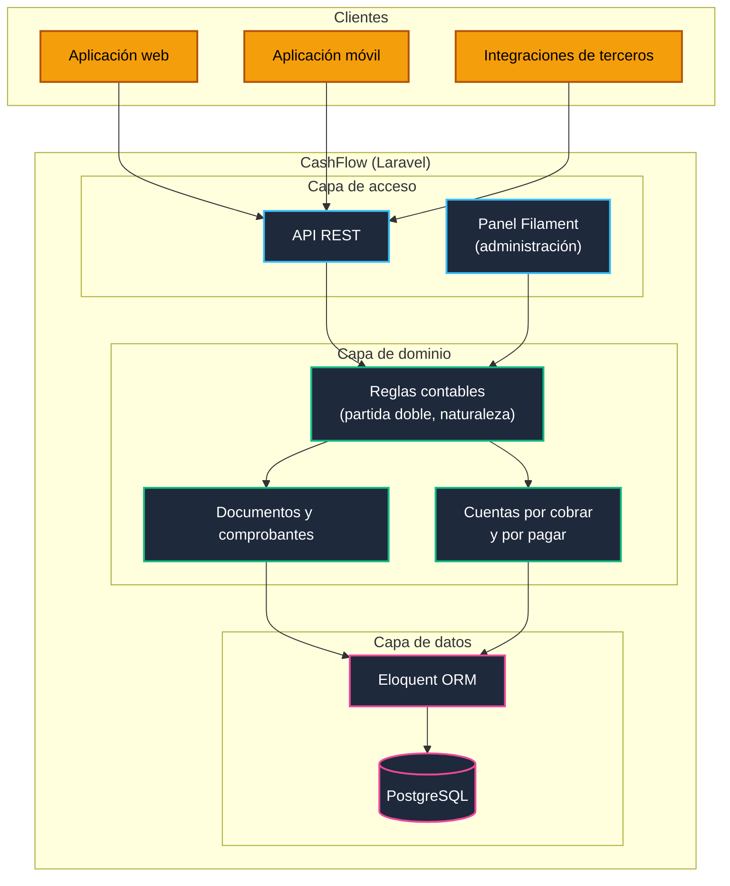
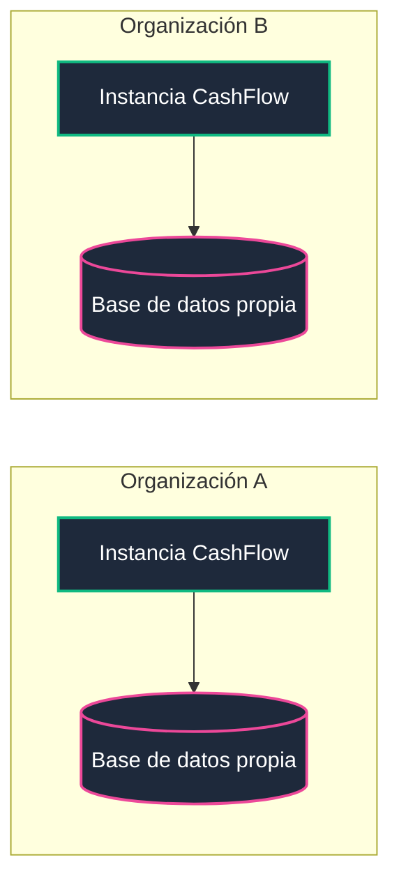
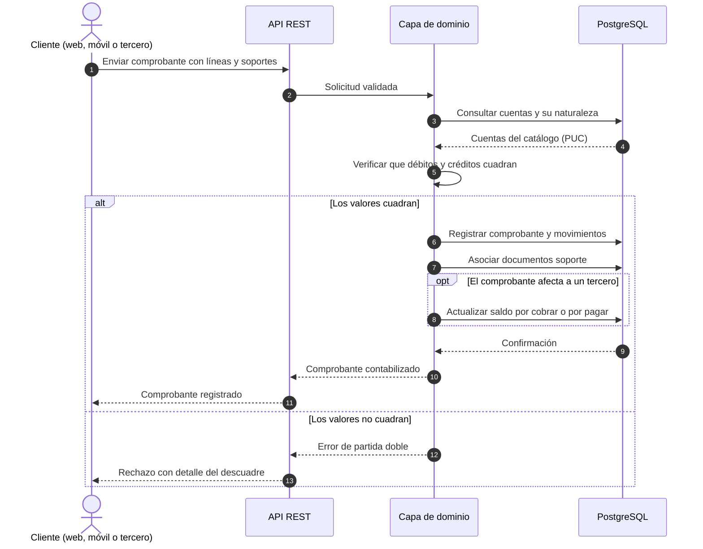
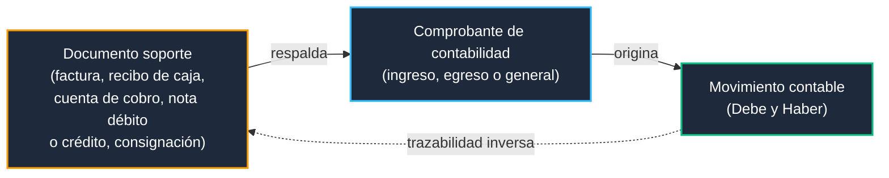
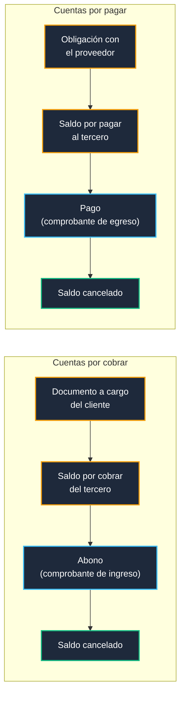
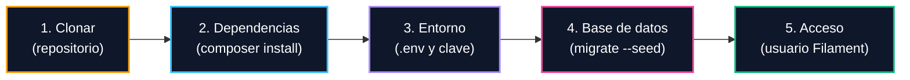

# CashFlow

**Sistema contable colombiano con motor API, basado en el Plan Único de Cuentas (PUC) y las Normas Internacionales de Información Financiera (NIIF).**

[](#2-arquitectura)
[](https://laravel.com)
[](https://filamentphp.com)
[](https://www.postgresql.org)
[](#5-modelo-contable)
[](#23-modelo-de-despliegue-mono-empresa)
[](LICENSE)

CashFlow es un sistema contable construido con Laravel y Laravel Filament. Implementa el catálogo de cuentas del PUC, registra los movimientos por partida doble y expone su lógica mediante una API, de modo que el panel administrativo, las aplicaciones móviles y las integraciones externas operen sobre las mismas reglas y los mismos datos.

Fue diseñado e implementado por Sandra Gabriela Puerto Torres a partir de una necesidad práctica: disponer de un sistema contable abierto y adaptable, formulado con la terminología y los documentos propios de la contabilidad colombiana. Su documentación busca, además, que sirva de referencia a las organizaciones que deseen construir una solución propia.

---

## 1. Descripción general

Los sistemas contables desarrollados a medida suelen presentar tres dificultades recurrentes. La primera es que las reglas contables quedan incorporadas en las pantallas y los controladores, lo que impide reutilizarlas desde otra plataforma. La segunda es que muchos modelos provienen de software extranjero y no reflejan la estructura del PUC, la naturaleza de las cuentas ni los comprobantes de uso local. La tercera es la dificultad para rastrear un movimiento contable hasta el documento que lo respalda.

CashFlow responde a estas dificultades con una capa de dominio independiente de la interfaz y una API que actúa como contrato de acceso. Las reglas de partida doble, la naturaleza de las cuentas y la validación de comprobantes se concentran en el dominio; la trazabilidad se garantiza desde el documento soporte hasta el movimiento contable.

Capacidades principales:

* Registro contable por partida doble, con la naturaleza de cada cuenta como regla de comportamiento.
* Gestión de cuentas por cobrar y cuentas por pagar por tercero, con saldos y vencimientos.
* Gestión de documentos soporte y comprobantes de contabilidad asociados a cada movimiento.
* API para consumo desde múltiples plataformas.
* Despliegue mono-empresa, con una instalación por organización.

CashFlow es una herramienta de software. La interpretación de las normas contables y tributarias, y su aplicación a cada organización, corresponde a un contador público.

---

## 2. Arquitectura

### 2.1 Topología de la plataforma



### 2.2 Principios de diseño

1. Toda funcionalidad debe poder utilizarse sin el panel administrativo.
2. Las reglas contables residen en la capa de dominio, y tanto la API como Filament acceden a ella directamente.
3. Un movimiento solo es válido cuando la suma de los débitos es igual a la suma de los créditos.
4. Los movimientos contabilizados no se sobrescriben; las correcciones se realizan mediante nuevos movimientos.

### 2.3 Modelo de despliegue: mono-empresa

Cada instalación de CashFlow atiende a una única organización. Cuando se requiere servir a varias, se despliega una instancia independiente para cada una.



Este modelo mantiene los datos de cada organización en una base de datos propia, sin filtros por empresa dentro de las consultas, y reduce la complejidad del sistema, puesto que el catálogo de cuentas, los terceros y los comprobantes pertenecen a una sola entidad contable. La multitenencia, entendida como varias empresas dentro de una misma instalación, queda fuera del alcance del diseño.

---

## 3. Módulos

| Módulo | Responsabilidad | Referencia contable |
| :--- | :--- | :--- |
| Registro contable | Movimientos por partida doble sobre el catálogo de cuentas | Débito (Debe), crédito (Haber) y naturaleza de la cuenta |
| Cuentas por cobrar | Valores pendientes de recibir de clientes, con saldo y vencimiento | Terceros y abonos |
| Cuentas por pagar | Obligaciones pendientes con proveedores y acreedores, con saldo y vencimiento | Terceros y pagos |
| Documentos y comprobantes | Evidencia que respalda cada movimiento contable | Documentos soporte y comprobantes de ingreso, egreso y general |

El alcance funcional se amplía de forma continua. El estado de cada módulo puede consultarse en los Issues y Projects del repositorio.

---

## 4. Flujo de una transacción

El siguiente diagrama describe el ciclo de un comprobante, desde su envío por parte del cliente hasta su registro contable.



---

## 5. Modelo contable

### 5.1 Reglas de integridad

El registro de cada comprobante es atómico: o se contabiliza completo, o no se contabiliza.

```
                  ┌─────────────────────────────────────────┐
                  │     REGLAS DE INTEGRIDAD CONTABLE       │
                  ├─────────────────────────────────────────┤
                  │ - Partida doble: suma Debe = suma Haber │
                  │ - Cada línea afecta una cuenta del PUC  │
                  │ - La naturaleza define el saldo normal  │
                  │ - Sin sobrescritura: las correcciones   │
                  │   se hacen con un nuevo movimiento      │
                  │ - Todo comprobante enlaza sus soportes  │
                  │ - Registro atómico                      │
                  └─────────────────────────────────────────┘
```

### 5.2 Naturaleza de las cuentas

Cada transacción afecta al menos dos cuentas, una por el Debe (débito) y otra por el Haber (crédito). La naturaleza de la cuenta indica si su saldo normal aumenta por el débito o por el crédito.

| Clase del PUC | Naturaleza | Aumenta con | Disminuye con |
| :--- | :---: | :---: | :---: |
| 1. Activo | Débito | Débito | Crédito |
| 2. Pasivo | Crédito | Crédito | Débito |
| 3. Patrimonio | Crédito | Crédito | Débito |
| 4. Ingresos | Crédito | Crédito | Débito |
| 5. Gastos | Débito | Débito | Crédito |
| 6. Costos de ventas | Débito | Débito | Crédito |
| 7. Costos de producción o de operación | Débito | Débito | Crédito |
| 8. Cuentas de orden deudoras | Débito | Débito | Crédito |
| 9. Cuentas de orden acreedoras | Crédito | Crédito | Débito |

Las cuentas de naturaleza contraria a la de su grupo, como la depreciación acumulada dentro del activo, se tratan según su propia naturaleza.

### 5.3 Documentos soporte y comprobantes de contabilidad

Los documentos soporte evidencian el hecho económico: facturas, recibos de caja, cuentas de cobro, notas débito y crédito, consignaciones y contratos, entre otros. Los comprobantes de contabilidad, que pueden ser de ingreso, de egreso o generales, sirven de fuente para registrar los movimientos. La relación entre ambos se conserva en los dos sentidos.



### 5.4 Cuentas por cobrar y por pagar

Cada tercero mantiene un saldo que se actualiza con los abonos, en el caso de los clientes, y con los pagos, en el caso de proveedores y acreedores. Ambos movimientos se registran mediante su comprobante de contabilidad correspondiente.



---

## 6. Stack tecnológico

| Capa | Tecnología |
| :--- | :--- |
| Lenguaje y framework | PHP y Laravel |
| Panel administrativo | Laravel Filament |
| Interfaz de integración | API REST |
| Acceso a datos | Eloquent ORM |
| Base de datos | PostgreSQL |

---

## 7. Puesta en marcha



Requisitos: PHP, Composer y PostgreSQL.

```bash
git clone https://github.com/sandra-puerto/cashflow.git
cd cashflow

composer install
cp .env.example .env
php artisan key:generate

# Configurar las credenciales de PostgreSQL en .env y luego:
php artisan migrate --seed

# Crear un usuario para el panel administrativo:
php artisan make:filament-user

php artisan serve
```

---

## 8. Guía para construir un ERP contable propio

Quienes deseen desarrollar una solución similar pueden tomar este proyecto como referencia. Las decisiones que conviene revisar con mayor atención son las siguientes:

1. Definir el grupo NIIF y el tipo de organización, pues de ello depende el catálogo de cuentas y los informes requeridos.
2. Separar la lógica contable en una capa de dominio, independiente del framework y de la interfaz.
3. Establecer desde el inicio el mecanismo de corrección de movimientos ya contabilizados.
4. Adaptar el catálogo de cuentas a la organización, tomando el PUC como base de referencia.
5. Validar el resultado con un contador público antes de utilizar las cifras para fines oficiales.

---

## 9. Contribuciones y mejoras de aplicación general

CashFlow evoluciona a partir de las mejoras de quienes lo utilizan. Las correcciones, funcionalidades y ajustes de aplicación general, es decir, aquellos que benefician a cualquier organización usuaria, deben notificarse a la autora conforme a lo establecido en la [licencia](LICENSE), con el fin de integrarlos en la rama principal y ponerlos a disposición de todas las organizaciones.

Las adaptaciones propias de una organización, como su configuración, su catálogo de cuentas personalizado o sus integraciones internas, quedan fuera de esta obligación.

Para proponer una mejora puede abrirse una solicitud de integración (pull request) contra la rama principal, o describirla en un Issue cuando se requiera discutir el enfoque previamente. Cada propuesta se revisa antes de integrarse, y su aceptación depende de que sea coherente con los principios de diseño y con el alcance del proyecto. Las contribuciones sobre normativa y práctica contable colombiana son especialmente valiosas.

---

## 10. Seguridad

Las vulnerabilidades deben comunicarse de forma privada a [contacto@sandrapuerto.com](mailto:contacto@sandrapuerto.com), sin abrir Issues públicos, e incluir una descripción del problema y los pasos para reproducirlo.

---

## 11. Organizaciones que confían en CashFlow

Se listan aquí las organizaciones que utilizan CashFlow y han sido informadas a la autora conforme a la [licencia](LICENSE).

---

## 12. Autora

CashFlow fue diseñado e implementado por **Sandra Gabriela Puerto Torres**, desarrolladora backend (PHP y Laravel) con experiencia en infraestructura TI.

* Stack: PHP, Laravel, Filament, PostgreSQL, Docker, Linux y Nginx
* Sitio web: [sandrapuerto.com](https://sandrapuerto.com)
* GitHub: [github.com/sandra-puerto](https://github.com/sandra-puerto)
* Contacto: [contacto@sandrapuerto.com](mailto:contacto@sandrapuerto.com)

---

## 13. Licencia

CashFlow se distribuye bajo una licencia personalizada basada en MIT, que permite el uso comercial, la modificación y la redistribución sin costo. Las organizaciones que lo utilicen en producción deben informarlo a la autora y autorizar la mención de su nombre en [sandrapuerto.com](https://sandrapuerto.com), y deben notificar las mejoras de aplicación general que desarrollen para su integración en la rama principal. Las pruebas, la evaluación, el desarrollo y el uso educativo no requieren notificación.

Las notificaciones se dirigen a [contacto@sandrapuerto.com](mailto:contacto@sandrapuerto.com). El texto completo se encuentra en [LICENSE](LICENSE).
