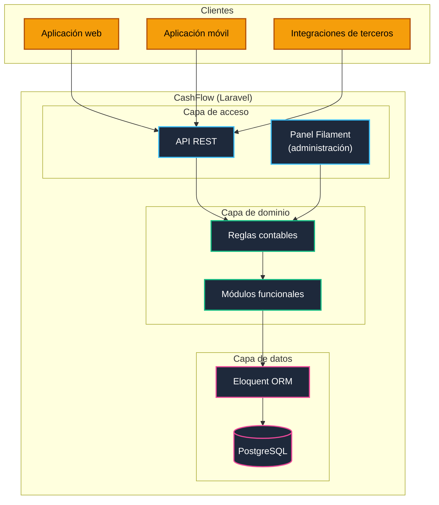
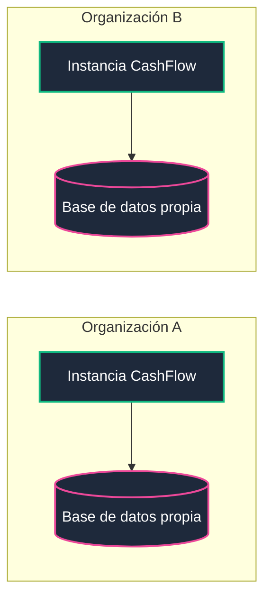
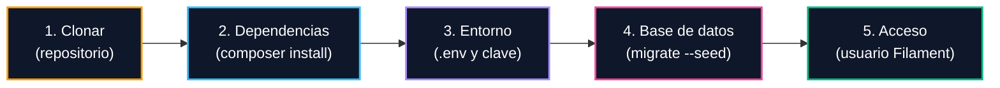

<div align="center">

# CashFlow

**ERP contable colombiano basado en el Plan Único de Cuentas (PUC) y las Normas Internacionales de Información Financiera (NIIF)**

[](#3-arquitectura)
[](https://laravel.com)
[](https://filamentphp.com)
[](https://www.postgresql.org)
[](#2-características)
[](#33-modelo-de-despliegue-mono-empresa)
[](LICENSE)

</div>

---

## Contenido

| | |
| :--- | :--- |
| [1. Presentación](#1-presentación) | [7. Contribuciones](#7-contribuciones-y-mejoras-de-aplicación-general) |
| [2. Características](#2-características) | [8. Seguridad](#8-seguridad) |
| [3. Arquitectura](#3-arquitectura) | [9. Organizaciones que confían en CashFlow](#9-organizaciones-que-confían-en-cashflow) |
| [4. Stack tecnológico](#4-stack-tecnológico) | [10. Autora](#10-autora) |
| [5. Puesta en marcha](#5-puesta-en-marcha) | [11. Licencia](#11-licencia) |
| [6. Guía para construir un ERP contable propio](#6-guía-para-construir-un-erp-contable-propio) | |

---

## 1. Presentación

CashFlow es un sistema de planificación de recursos empresariales (ERP) de orientación contable, desarrollado para el contexto colombiano. Su modelo de datos se fundamenta en el Plan Único de Cuentas y adopta como marco de referencia las NIIF. Está construido con Laravel y Laravel Filament, y expone su lógica a través de una API diseñada para el consumo desde múltiples plataformas.

El proyecto fue diseñado e implementado por Sandra Gabriela Puerto Torres a partir de una necesidad práctica: disponer de un sistema contable abierto y adaptable, formulado con la terminología y los documentos propios de la contabilidad colombiana. Su documentación se concibe, además, como una referencia para las organizaciones que deseen construir una solución propia.

CashFlow es una herramienta de software. La interpretación de las normas contables y tributarias, y su aplicación a cada organización, corresponde a un contador público.

---

## 2. Características

El estado de cada característica se actualiza conforme avanza su desarrollo.

<!-- Para actualizar: modificar la columna Estado con uno de los valores definidos (Desarrollo, Pruebas, Producción). -->

| Característica | Descripción | Estado |
| :--- | :--- | :---: |
| Registro contable por partida doble | Registro de movimientos conforme a la partida doble y a la naturaleza de las cuentas | Desarrollo |
| Cuentas por cobrar | Gestión de los valores pendientes de recibir de clientes | Desarrollo |
| Cuentas por pagar | Gestión de las obligaciones pendientes con proveedores y acreedores | Desarrollo |
| Documentos y comprobantes | Gestión de documentos soporte y comprobantes de contabilidad asociados a cada movimiento | Desarrollo |

**Estados**

| Estado | Significado |
| :--- | :--- |
| Desarrollo | La característica se encuentra en construcción y no está lista para su uso. |
| Pruebas | La característica está implementada y en proceso de verificación. |
| Producción | La característica ha sido verificada y está disponible para su uso. |

---

## 3. Arquitectura

### 3.1 Topología de la plataforma

La lógica contable reside en una capa de dominio independiente de la interfaz. Tanto la API como el panel administrativo acceden a ella directamente.



### 3.2 Principios de diseño

1. Toda funcionalidad debe poder utilizarse sin el panel administrativo.
2. Las reglas contables residen en la capa de dominio, y tanto la API como Filament acceden a ella directamente.
3. Un movimiento solo es válido cuando la suma de los débitos es igual a la suma de los créditos.
4. El registro de cada comprobante es atómico: se contabiliza completo o no se contabiliza.
5. Los movimientos contabilizados no se sobrescriben; las correcciones se realizan mediante nuevos movimientos.
6. Todo movimiento debe poder rastrearse hasta el documento que lo respalda.

### 3.3 Modelo de despliegue: mono-empresa

Cada instalación de CashFlow atiende a una única organización. Cuando se requiere servir a varias, se despliega una instancia independiente para cada una.



Este modelo mantiene los datos de cada organización en una base de datos propia, sin filtros por empresa dentro de las consultas, y reduce la complejidad del sistema, puesto que el catálogo de cuentas, los terceros y los comprobantes pertenecen a una sola entidad contable. La multitenencia, entendida como la coexistencia de varias empresas dentro de una misma instalación, queda fuera del alcance del diseño.

---

## 4. Stack tecnológico

| Capa | Tecnología |
| :--- | :--- |
| Lenguaje y framework | PHP y Laravel |
| Panel administrativo | Laravel Filament |
| Interfaz de integración | API REST |
| Acceso a datos | Eloquent ORM |
| Base de datos | PostgreSQL |

---

## 5. Puesta en marcha



Requisitos: PHP, Composer y PostgreSQL.

```bash
git clone https://github.com/sandra-puerto/cashflow.git
cd cashflow

composer install
cp .env.example .env
php artisan key:generate

# Configurar las credenciales de PostgreSQL en .env y luego:
php artisan migrate --seed

# Crear un usuario para el panel administrativo:
php artisan make:filament-user

php artisan serve
```

---

## 6. Guía para construir un ERP contable propio

Quienes deseen desarrollar una solución similar pueden tomar este proyecto como referencia. Las decisiones que conviene revisar con mayor atención son las siguientes:

1. Definir el grupo NIIF y el tipo de organización, pues de ello depende el catálogo de cuentas y los informes requeridos.
2. Separar la lógica contable en una capa de dominio, independiente del framework y de la interfaz.
3. Establecer desde el inicio el mecanismo de corrección de movimientos ya contabilizados.
4. Adaptar el catálogo de cuentas a la organización, tomando el PUC como base de referencia.
5. Validar el resultado con un contador público antes de utilizar las cifras para fines oficiales.

---

## 7. Contribuciones y mejoras de aplicación general

CashFlow evoluciona a partir de las mejoras de quienes lo utilizan. Las correcciones, funcionalidades y ajustes de aplicación general, es decir, aquellos que benefician a cualquier organización usuaria, deben notificarse a la autora conforme a lo establecido en la [licencia](LICENSE), con el fin de integrarlos en la rama principal y ponerlos a disposición de todas las organizaciones.

Las adaptaciones propias de una organización, como su configuración, su catálogo de cuentas personalizado o sus integraciones internas, quedan fuera de esta obligación.

Para proponer una mejora puede abrirse una solicitud de integración (pull request) contra la rama principal, o describirla en un Issue cuando se requiera discutir el enfoque previamente. Cada propuesta se revisa antes de integrarse, y su aceptación depende de que sea coherente con los principios de diseño y con el alcance del proyecto. Las contribuciones sobre normativa y práctica contable colombiana son especialmente valiosas.

---

## 8. Seguridad

Las vulnerabilidades deben comunicarse de forma privada, sin abrir Issues públicos. El procedimiento completo se describe en [SECURITY.md](SECURITY.md).

---

## 9. Organizaciones que confían en CashFlow

Se listan aquí las organizaciones que utilizan CashFlow y han sido informadas a la autora conforme a la [licencia](LICENSE).

---

## 10. Autora

CashFlow fue diseñado e implementado por **Sandra Gabriela Puerto Torres**, desarrolladora backend (PHP y Laravel) con experiencia en infraestructura TI.

| | |
| :--- | :--- |
| Stack | PHP, Laravel, Filament, PostgreSQL, Docker, Linux y Nginx |
| Sitio web | [sandrapuerto.com](https://sandrapuerto.com) |
| GitHub | [github.com/sandra-puerto](https://github.com/sandra-puerto) |
| Contacto | [contacto@sandrapuerto.com](mailto:contacto@sandrapuerto.com) |

---

## 11. Licencia

CashFlow se distribuye bajo una licencia personalizada basada en MIT, que permite el uso comercial, la modificación y la redistribución sin costo. Las organizaciones que lo utilicen en producción deben informarlo a la autora y autorizar la mención de su nombre en [sandrapuerto.com](https://sandrapuerto.com), y deben notificar las mejoras de aplicación general que desarrollen para su integración en la rama principal. Las pruebas, la evaluación, el desarrollo y el uso educativo no requieren notificación.

Las notificaciones se dirigen a [contacto@sandrapuerto.com](mailto:contacto@sandrapuerto.com). El texto completo se encuentra en [LICENSE](LICENSE).
