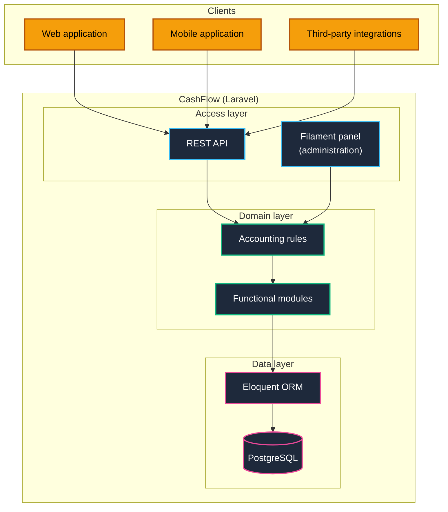
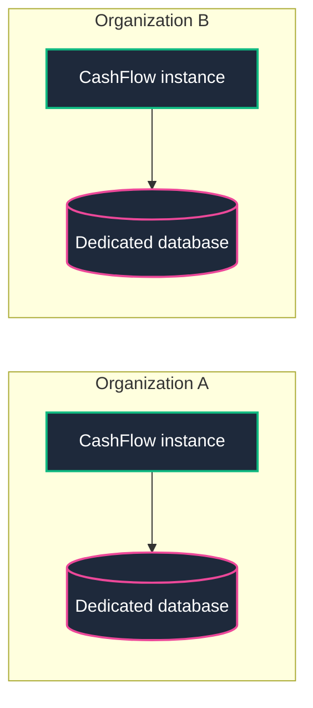
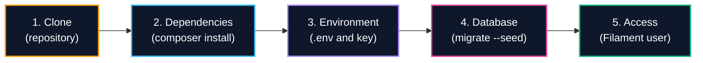

<div align="center">

# CashFlow

**Colombian accounting ERP based on the Plan Único de Cuentas (PUC) and the International Financial Reporting Standards (IFRS, known in Colombia as NIIF)**

[](#3-architecture)
[](https://laravel.com)
[](https://filamentphp.com)
[](https://www.postgresql.org)
[](#2-features)
[](#33-deployment-model-single-organization)
[](LICENSE)

</div>

---

## Contents

| | |
| :--- | :--- |
| [1. Overview](#1-overview) | [7. Contributions](#7-contributions-and-general-purpose-improvements) |
| [2. Features](#2-features) | [8. Security](#8-security) |
| [3. Architecture](#3-architecture) | [9. Organizations that trust CashFlow](#9-organizations-that-trust-cashflow) |
| [4. Technology stack](#4-technology-stack) | [10. Author](#10-author) |
| [5. Getting started](#5-getting-started) | [11. License](#11-license) |
| [6. Guide to building an accounting ERP of your own](#6-guide-to-building-an-accounting-erp-of-your-own) | |

---

## 1. Overview

CashFlow is an enterprise resource planning (ERP) system with an accounting focus, developed for the Colombian context. Its data model is grounded in the Plan Único de Cuentas (PUC), the standard chart of accounts used in Colombia, and it adopts IFRS (NIIF) as its reporting framework. It is built with Laravel and Laravel Filament, and exposes its logic through an API designed to be consumed from multiple platforms.

The project was designed and implemented by Sandra Gabriela Puerto Torres in response to a practical need: an open and adaptable accounting system, formulated with the terminology and documents characteristic of Colombian accounting. Its documentation is also intended as a reference for organizations that wish to build a solution of their own.

CashFlow is a software tool. The interpretation of accounting and tax regulations, and their application to each organization, is the responsibility of a certified public accountant.

---

## 2. Features

The status of each feature is updated as its development progresses.

<!-- To update: change the Status column to one of the defined values (Development, Testing, Production). -->

| Feature | Description | Status |
| :--- | :--- | :---: |
| Double-entry bookkeeping | Recording of transactions according to double-entry principles and the nature of each account | Development |
| Accounts receivable | Management of amounts owed to the organization by customers | Development |
| Accounts payable | Management of outstanding obligations to suppliers and creditors | Development |
| Documents and vouchers | Management of supporting documents and accounting vouchers linked to each transaction | Development |

**Statuses**

| Status | Meaning |
| :--- | :--- |
| Development | The feature is under construction and is not ready for use. |
| Testing | The feature is implemented and undergoing verification. |
| Production | The feature has been verified and is available for use. |

---

## 3. Architecture

### 3.1 Platform topology

The accounting logic resides in a domain layer that is independent of any interface. Both the API and the administrative panel access it directly.



### 3.2 Design principles

1. Every capability must be usable without the administrative panel.
2. Accounting rules reside in the domain layer, which both the API and Filament access directly.
3. A transaction is valid only when the sum of its debits equals the sum of its credits.
4. The recording of each voucher is atomic: it is posted in full or not posted at all.
5. Posted transactions are never overwritten; corrections are made through new transactions.
6. Every transaction must be traceable to the document that supports it.

### 3.3 Deployment model: single-organization

Each CashFlow installation serves a single organization. When several organizations must be served, an independent instance is deployed for each one.



This model keeps each organization's data in a dedicated database, without per-company filters in queries, and reduces the complexity of the system, since the chart of accounts, third parties and vouchers belong to a single accounting entity. Multi-tenancy, understood as the coexistence of several companies within one installation, is outside the scope of the design.

---

## 4. Technology stack

| Layer | Technology |
| :--- | :--- |
| Language and framework | PHP and Laravel |
| Administrative panel | Laravel Filament |
| Integration interface | REST API |
| Data access | Eloquent ORM |
| Database | PostgreSQL |

---

## 5. Getting started



Requirements: PHP, Composer and PostgreSQL.

```bash
git clone https://github.com/sandra-puerto/cashflow.git
cd cashflow

composer install
cp .env.example .env
php artisan key:generate

# Set the PostgreSQL credentials in .env, then:
php artisan migrate --seed

# Create a user for the administrative panel:
php artisan make:filament-user

php artisan serve
```

---

## 6. Guide to building an accounting ERP of your own

Those who wish to develop a similar solution may use this project as a reference. The decisions that deserve the closest attention are the following:

1. Define the applicable IFRS (NIIF) group and the type of organization, as the chart of accounts and the required reports depend on them.
2. Separate the accounting logic into a domain layer, independent of the framework and of the interface.
3. Establish from the outset the mechanism for correcting transactions that have already been posted.
4. Adapt the chart of accounts to the organization, taking the PUC as a reference baseline.
5. Validate the result with a certified public accountant before using the figures for official purposes.

---

## 7. Contributions and general-purpose improvements

CashFlow evolves through the improvements made by those who use it. Fixes, features and adjustments of general applicability, that is, those that benefit any user organization, must be notified to the author in accordance with the [license](LICENSE), so that they can be integrated into the main branch and made available to all organizations.

Adaptations specific to an organization, such as its configuration, its customized chart of accounts or its internal integrations, are excluded from this obligation.

To propose an improvement, a pull request may be opened against the main branch, or an Issue may be created when the approach needs to be discussed beforehand. Each proposal is reviewed before being integrated, and its acceptance depends on its consistency with the design principles and the scope of the project. Contributions concerning Colombian accounting regulation and practice are especially valuable.

---

## 8. Security

Vulnerabilities must be reported privately, without opening public Issues. The complete procedure is described in [SECURITY.md](SECURITY.md).

---

## 9. Organizations that trust CashFlow

This section lists the organizations that use CashFlow and have informed the author in accordance with the [license](LICENSE).

---

## 10. Author

CashFlow was designed and implemented by **Sandra Gabriela Puerto Torres**, a backend developer (PHP and Laravel) with experience in IT infrastructure.

| | |
| :--- | :--- |
| Stack | PHP, Laravel, Filament, PostgreSQL, Docker, Linux and Nginx |
| Website | [sandrapuerto.com](https://sandrapuerto.com) |
| GitHub | [github.com/sandra-puerto](https://github.com/sandra-puerto) |
| Contact | [contacto@sandrapuerto.com](mailto:contacto@sandrapuerto.com) |

---

## 11. License

CashFlow is distributed under a custom MIT-based license that permits commercial use, modification and redistribution at no cost. Organizations that use CashFlow in production must inform the author and authorize the mention of their name on [sandrapuerto.com](https://sandrapuerto.com), and must notify the author of any general-purpose improvements they develop so that these can be integrated into the main branch. Testing, evaluation, development and educational use do not require notification.

Notifications should be sent to [contacto@sandrapuerto.com](mailto:contacto@sandrapuerto.com). The full text is available in [LICENSE](LICENSE).
